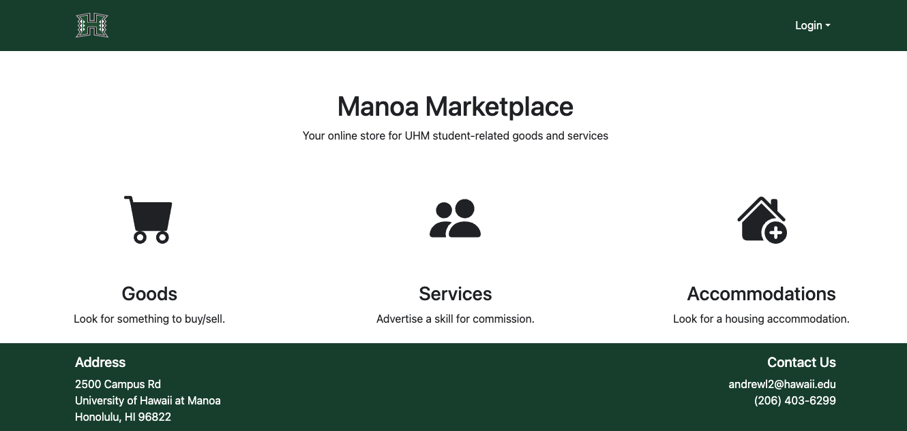
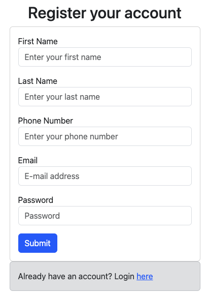
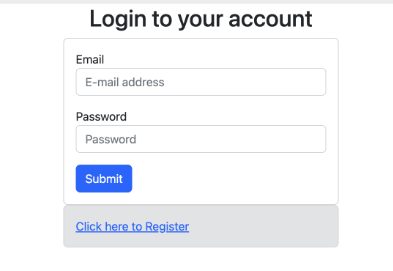
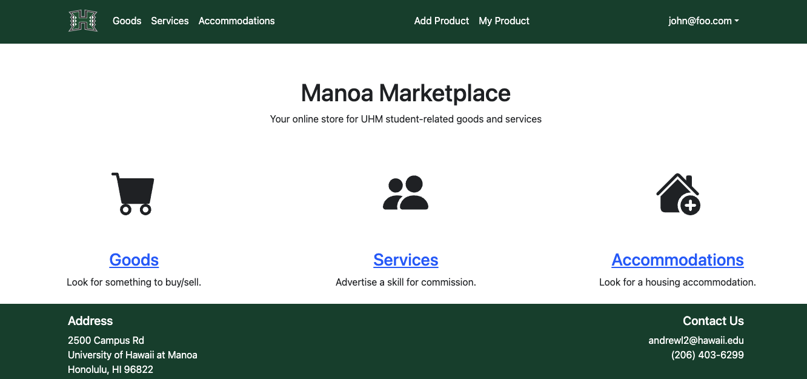
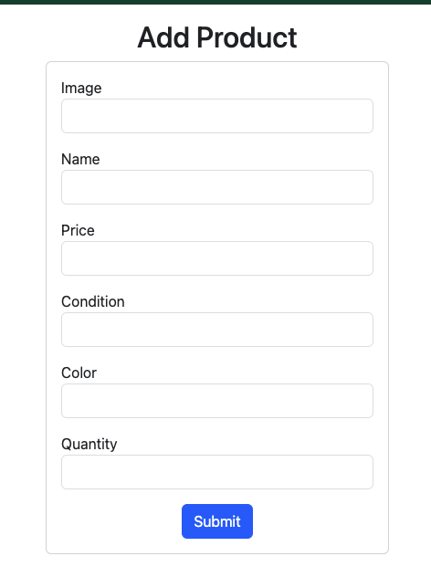
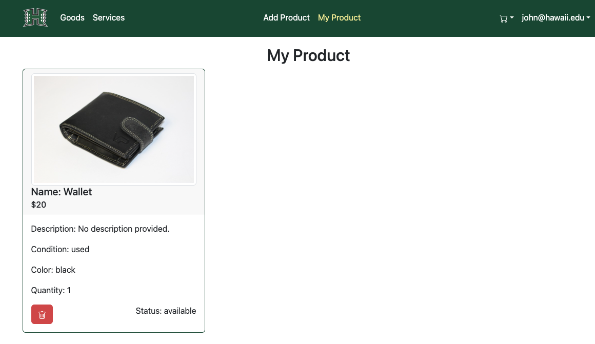
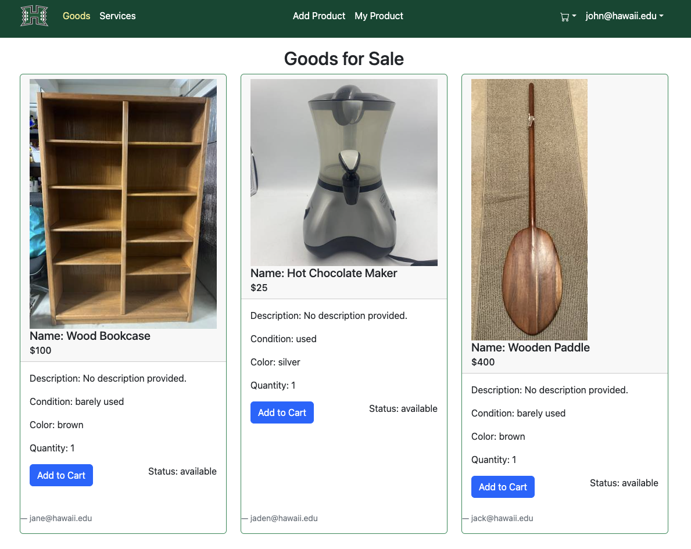
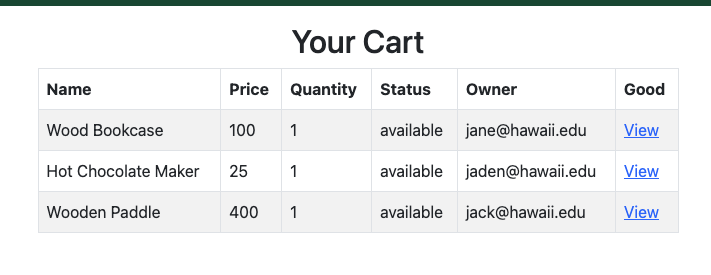

# Manoa Marketplace

_An online marketplace of all things you can buy/sell for the 'Bows!_

## Table of contents

* [Overview](#overview)
* [Deployment](#deployment)
* [User Guide](#user-guide)
* [Community Feedback](#community-feedback)
* [Developer Guide](#developer-guide)
* [Development History](#development-history)
* [Contact Us](#contact-us)

## Overview

The problem: UHM students have a “rapid” churn rate in goods and services. Students leave the dorm for an on-campus apartment and need to get rid of dorm-specific stuff and acquire apartment-specific stuff. Students graduate and need to get rid of
stuff because they’re moving off-island. There is therefore a tremendous amount of “campus-specific” goods and services that could be more effectively recycled and reused if there was an effective marketplace for these specific kinds of items.

The solution: The Manoa Marketplace is an application for UHM students to facilitate buying and selling of student-related goods and services.

### Approach

* Buyers and sellers must be UH students, faculty, or staff
* There is no anonymity: buyers and sellers connect through their UH credentials
* Transactions are expected to occur on campus. If a seller wants to meet off-campus, that can be a red flag
* Because buyers and sellers are from UHM, the goods and services will be relevant to UH students

### Implementation

Manoa Marketplace is designed with the following technologies:

* [Meteor](https://www.meteor.com/) for Javascript-based implementation of client and server code
* [Bootstrap 5 React](https://react-bootstrap.github.io/) for user interface
* [Uniforms](https://uniforms.tools/) for form development

## Deployment

See the Manoa Marketplace in deployment through Digital Ocean at https://manoa-marketplace.shop

[](https://github.com/ics-software-engineering/meteor-application-template-react/actions/workflows/ci.yml)

## User Guide

This section provides a walkthrough of the Manoa Marketplace user interface and its capabilities.

### Landing Page

The landing page is presented to students when they visit the top-level URL of the site. It provides a brief description of the application, and directs students to sign up or log in.



### Sign Up Page

The sign up page will direct students to register using their @hawaii.edu email and fill in some basic user information.



### Log In Page

The log in page will direct students to log in using the registered @hawaii.edu account.



### Home Page

After logging in, the student will be directed to their home page. More features of the app are now displayed for the student in the navbar section.



### My Profile Page

The user is also able to go into their profile to see an overview of their user information, as well as some other statistics (WIP).

### Edit Profile Page

The user is able to click the link to bring up a form to edit their profile information.

### Add Product Page

Students have the ability to add a product for sale. Once added, the product will be listed on the List Product Page for their own perusal.



### My Products Page

Students can list out all the products that they own, edit/delete the products.



### List Goods Page

This page displays all (excluding the user's) public goods that are available for sale. The user can click on the button to add to cart for checkout later.



### My Cart Page

After adding a product to the cart, the user can view all the products that they have added to the cart. The user can also remove the product from the cart, or view the individual product page (WIP).



## Community Feedback

We are eager to know how you liked the Manoa Marketplace! After experiencing the application, please take a couple of minutes to fill out the [Manoa Marketplace Feedback Form](https://forms.gle/4wUn5QGKwvkbddfY6). It will greatly help us understand
how our system is, improve existing features, or implement new ones. Mahalo!

Here are some of the feedbacks we have received so far (CAO 11 Dec 23):
* _Overall, the project as a whole could feel better made. The website's design can be referred to other commercial websites, and the communication and work distribution between the project team needs to be adjusted according to the understanding of the project._
* _I like the pop up text that shows a checkmark whenever I add an item to my cart, gives the impression that I'm on the right path for purchasing the item._
* _Cart menu is organized. Straightforward to look at and review your items before checking out._
* _I like how hyperlinks allow users to conveniently get to the goods/services they're trying to acquire._
* _I like how the address and contact information remains at the bottom of the webpage, so it's clear as day as to where and who users need to contact for questions regarding the goods/services._

Here are some of the suggestions for improvements so far (CAO 11 Dec 23):
* The overall lack of design on the site feels rough, which can manifest itself in the following:
    1. The landing page is monotonous, and there is a need for more color and pictures to beautify, such as different background colors for each part of the distinction so that users can have the desire to understand the project.
    2. The default navbar can add some "About Us" pages and tutorials.
    3. "Add Product" and "My Product" in the navbar are not centered.
    4. the project may need an icon to show the personalization of the project.
    5. Perhaps a more aesthetically pleasing way to list items would be to use a different list than a "card."
    6. Add a filtering and sorting system for products, such as sorting products by category and price, etc., when adding a product or being in a product list.
    7. add a communication system between sellers and buyers.

* _A location on the item being sold would also go nice, as the only details I see are relating to it's condition and quantity. Including a policy page to website would be beneficial, as to ensure users know what is legally allowed and not allowed
  (i.e. refunds, what can be sold/serviced, etc.). Include possible an area on the side for advertisements._
* _Having the background change with each submenu (i.e. a relevant picture relating to the submenu) would help with keeping users engaged with the webpage. An option to add multiple pictures so users can add multiple angles of the products they're trying to sell would help users to sell their items. Having a hyperlink to allow users to give their feedback on would be beneficial._

## Developer Guide

This section provides information of interest to Meteor developers wishing to use this application for their own development tasks.

### Installation

1. [install Meteor](https://www.meteor.com/install)
2. Visit the [Manoa Marketplace GitHub page](https://github.com/manoa-market-place/manoa-market-place), and click the "Use this template" button to create your own repository with initialized with a copy of this application. Alternatively, you
   can download the source code as a zip file or make a fork of the repo. However you do it, download a copy of the repo to your local computer.
3. cd into the manoa-market-place/app directory and install libraries with:
    1. ```
       $ meteor npm install
       ```
4. Run the system with:
    1. ```
       $ meteor npm run start
       ```
5. If all goes well, you can view your application at [http://localhost:3000](http://localhost:3000)
6. You can login using the credentials in [settings.development.json](), or else register a new account.

### ESLint

YOu can verify that the code obeys our coding standards by running ESLint over the code in the imports/ directory with:

```
$ meteor npm run lint
```

## Development History

The development process for Manoa Marketplace conformed to [Issue Driven Project Management (IDPM)](https://courses.ics.hawaii.edu/ics314f23/morea/project-management/reading-guidelines-idpm.html) agile software process. Bottom line up front (BLUF):

* Process was managed using milestones that provide "deliverables" every 7-14 days.
* Within each milestone contains a series of tasks as GitHub Issues taking ideally 2~3 days to accomplish
* The work performed on each issue is in its own branch named "issue-XX", where XX is the issue number, and merged back into the main branch after its completion
* The status of each issue (todo, in progress, complete) under a milestone is managed using the GitHub Project Board

The following sections document the development history of the Manoa Marketplace.

### Milestone 1: Mockup Development

The goal of Milestone 1 (M1) was to set up the team, create initial issues, and deploy the initial application system to Digital Ocean with a landing page and at least four other mockup pages.

M1 was managed using [Manoa Marketplace GitHub Project Board M1](https://github.com/orgs/manoa-market-place/projects/4):

### Milestone 2: Full Development

The goal of Milestone 2 (M2) was to continue managing the project and implement the core functionalities of the application.

M2 was managed using [Manoa Marketplace GitHub Project Board M2](https://github.com/orgs/manoa-market-place/projects/2):

### Milestone 3: Final Touches

The goal of Milestone 3 (M3) was to finish the project, acquire community feedback, and implement acceptance testing.

M3 was managed using [Manoa Marketplace GitHub Project Board M3](https://github.com/orgs/manoa-market-place/projects/3):

### Beyond the basics

The following contains yet-to-be-implemented ideas for more advanced features of the Manoa Marketplace:

* A rating system for buyers and sellers
* Map-based interface to indicate where goods are

### Links

* The [Manoa Marketplace GitHub organization](https://github.com/manoa-market-place)
    * [Home Page Repository](https://github.com/manoa-market-place/manoa-market-place.github.io)
    * [Project Template Repository](https://github.com/manoa-market-place/manoa-market-place)
* The Devs' [Team Contract](https://docs.google.com/document/d/1OdRn9MrF8nA7VsuvTfltd_V8z3SGdCiK7xZjGK6fZQo/edit?usp=sharing)

## Contact Us

Manoa Marketplace is designed, implemented, and maintained by the following developers:

* [Andrew Lin]()
* [Baishen Wang]()
* [Bing Ying Li]()
* [Carlton Hung]()
* [Yujie He]()
